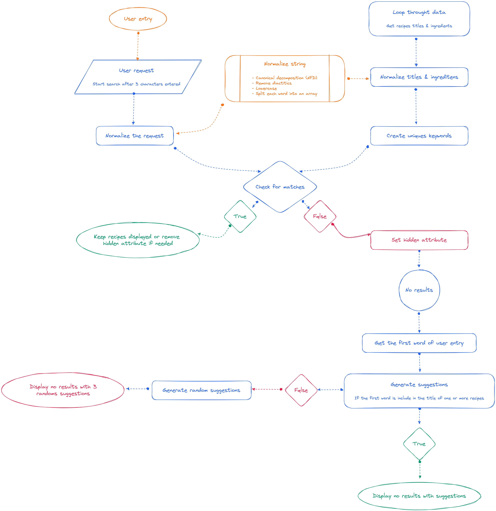

# Les Petits Plats


## Overview

The project was to build a search engine for recipes. The search engine is based on a database of recipes (JSON).

## Features

### Mandatory features

- User can search for a recipe by typing a keyword in the search bar
- User can see the list of recipes matching the keyword
- User can filter the list of recipes by categories (ingredients, appliances, ustensils)
- Filters must be dynamic with the list of recipes

### Personal additions

- Adding a modal to display the recipe details
- Allow the user to increase/decrease the number of servings
- Allow wuser to browse recipes with the arrow keys
- Adding suggestions based on search if no results
- Adding random suggestions if no suggestions
- Adding a reset button to clear all tags
- User can focus on the search bar by pressing the "CTRL + K" or "CMD + K" keys
- User can clear the search bar by pressing the "ESC" key
- Adding a pre loader
- Adding a scroll to top button
- Adding thumbnails to the recipes

## Stack

For this project I used the following technologies:

- HTML / SCSS
- JavaScript (vanilla)
- [ViteJS](https://vitejs.dev/)

## Local Setup

### Clone the repository

```bash
git clone https://github.com/alexperronnet/openclassrooms-p7-les-petits-plats.git
```

### Navigate to the project folder

```bash
cd openclassrooms-p7-les-petits-plats
```

### Install dependencies

```bash
npm install
```

### Run the application

```bash
npm run dev
```

## Search algorithms

All the search algorithms follow the same logic, only the method used changes.

|            | **Algo A** | **Algo B** | **Algo C** | **Algo D** | **Algo E** | **Algo F** |
| :--------: | :--------: | :--------: | :--------: | :--------: | :--------: | :--------: |
| **Method** |  forEach   |    map     |   reduce   |   filter   |  for loop  | while loop |

### Algorigram



### Performances


> What we notice is that the differences between each algorithm are really significant, however in a great majority of cases the C algorithm (with the reduce method) is more efficient.

## Lighthouse report

### Desktop


### Mobile


## Validation

### HTML


### CSS


## Deployment

The application is deployed on [Netlify](https://www.netlify.com/).

## License

This is an OpenClassrooms project. The code is freely reusable, but assets (images, videos and logo) are not because they are not mine.

If you are also a student of OC, you can freely use my work as inspiration, but I advise you not to copy parts of it.

## Personal advice

This project has the potential to be a good project, however the JSON file is not very well structured and it is not easy to work with it. We also can see the limitations of vanilla JavaScript for this type of project.
